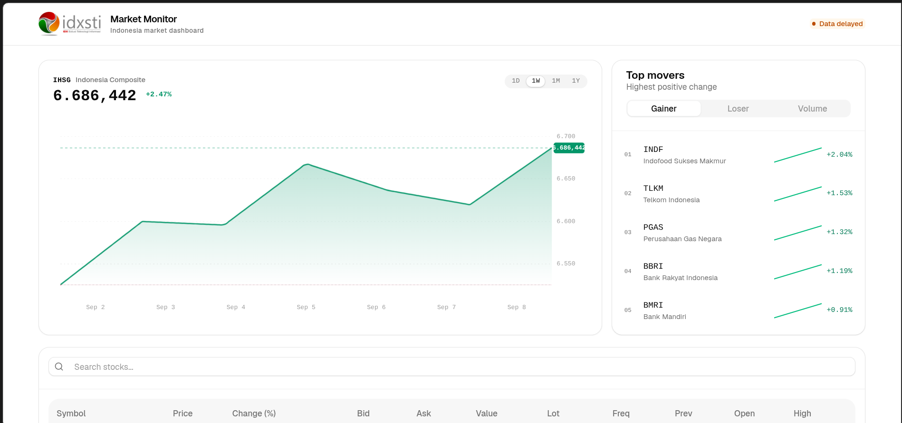
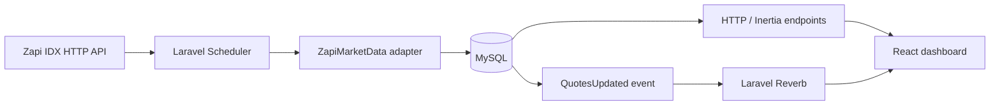

# Market Monitor

<div align="center">
  
  <h1>Market Monitor</h1>
  <p>Indonesia market dashboard for the System Developer Intern mini case at IDXSTI.</p>
  <p>
    <a href="https://idxsti.bangpens.my.id">Live demo</a>
    ·
    <a href="https://github.com/afenmarbun/market-monitor">Source code</a>
  </p>
</div>



Market Monitor is a single-page Indonesian stock market dashboard built with Laravel, Inertia React, MySQL, Zapi IDX API, and Laravel Reverb. It presents live quotes when the provider is available, a 30-calendar-day index view, top movers, and a dense quote table with search and pagination.

> [!IMPORTANT]
> Zapi is an HTTP polling provider, not a streaming WebSocket feed. Reverb provides real-time delivery from the backend to connected browsers after a new provider snapshot is received. The application is designed for market information and monitoring, not trading execution or low-latency market data.

## Highlights

- IHSG chart with decimal index values and up to 30 calendar days of Zapi history.
- Top five gainers, losers, and highest-volume stocks with tab selection.
- Quote table with symbol, price, percentage change, bid, ask, value, lot, frequency, previous close, open, high, and low.
- Server-side Zapi integration; the API key never enters the React bundle.
- Laravel scheduler for provider polling and Laravel Reverb for browser updates through `quotes.updated`.
- HTTP resync endpoints so the dashboard can recover when a WebSocket connection is interrupted.
- Explicit live-data handling: the application does not generate dummy quotes or simulated prices.
- Responsive light-mode interface using local COSS/shadcn-compatible components and Tailwind CSS.

## Architecture



The backend is the source of truth. `ZapiMarketData` requests and normalizes `stock-summary` and `index-summary` responses, then persists live stock quotes and price points. `MarketSnapshot` exposes a stable application contract to React, while `QuotesUpdated` broadcasts the latest normalized snapshot to the public `market` channel.

The main domain records are:

| Record | Purpose |
| --- | --- |
| `instruments` | Stock catalog: symbol, company name, and sector. |
| `quotes` | Latest live quote and market fields for each instrument. |
| `price_points` | Live historical points used by stock charts. |
| Cache entries | Provider rate limiting, index snapshots, 30-day index history, and provider status. |

Stock prices are normalized as integer rupiah values, while index values such as IHSG may retain decimal precision. Every returned quote includes `source` and `quoted_at` so the UI can distinguish live data from unavailable data and display freshness correctly.

## Data flow and communication

The scheduler runs `market:tick` every five seconds, while `ZapiMarketData` enforces `MARKET_DATA_POLL_SECONDS` and the IDX trading-session window before making a provider request. This prevents every browser from polling Zapi independently and keeps the provider request rate under control. A successful request updates MySQL first, refreshes index data, and then dispatches the `quotes.updated` event.

The browser receives its initial snapshot through Inertia and uses JSON endpoints for resynchronization:

| Endpoint | Purpose |
| --- | --- |
| `GET /` | Render the dashboard through Inertia. |
| `GET /api/market/snapshot` | Return the latest live quote snapshot. |
| `GET /api/market/indices` | Return IHSG, LQ45, IDX30, and index history. |
| `GET /api/market/status` | Return provider configuration, market session, and freshness status. |
| `GET /api/market/{symbol}/history?range=1h\|24h` | Return live price points for a symbol. |
| `market` / `.quotes.updated` | Reverb channel and event used for browser updates. |

The WebSocket path is deliberately complemented by periodic HTTP resync. This means the dashboard remains usable if a browser sleeps, a proxy drops an idle socket, or Reverb is temporarily unavailable.

## Data provider note

Zapi exposes the IDX datasets through HTTP request-response endpoints. That makes the integration reliable for snapshots and periodic monitoring, but it cannot provide tick-by-tick updates by itself. For true low-latency real-time data, the provider layer should eventually be extended with an official IDX or licensed market-data streaming feed. Zapi can remain useful for historical backfill, daily snapshots, and recovery after a streaming reconnect.

## Requirements

- PHP 8.4+
- Composer
- Node.js 22+
- npm
- MySQL 8.4 for the production Compose stack, or SQLite for a lightweight local setup
- A Zapi IDX API key for live market data

## Local development

1. Clone the repository and install backend dependencies:

   ```bash
   git clone https://github.com/afenmarbun/market-monitor.git
   cd market-monitor
   composer install
   ```

2. Create the environment file and application key:

   ```bash
   cp .env.example .env
   php artisan key:generate
   ```

3. Configure the live provider in `.env`:

   ```dotenv
   MARKET_DATA_PROVIDER=zapi
   ZPI_API_KEY=your-server-side-key
   ZPI_BASE_URL=https://api.zpi.web.id/v1/finance:idx
   MARKET_DATA_POLL_SECONDS=900
   MARKET_DATA_ONLY_OPEN_SESSION=true
   ```

   Keep `ZPI_API_KEY` server-side. If the key is missing, `market:tick` fails rather than creating synthetic quotes.

4. Install frontend dependencies, create the instrument catalog, and build assets:

   ```bash
   npm install
   php artisan migrate --seed
   npm run build
   ```

5. Run the application in separate terminals:

   ```bash
   php artisan serve
   npm run dev
   php artisan schedule:work
   ```

   Open `http://localhost:8000`. If you are testing outside the IDX trading session, set `MARKET_DATA_ONLY_OPEN_SESSION=false` temporarily to verify a provider request, subject to Zapi availability and usage limits.

## Production deployment with Docker Compose

The production stack contains PHP-FPM, Nginx, MySQL, the Laravel scheduler, and Reverb. Only the web service is bound to the host; MySQL and Reverb stay on the Docker network. Caddy or another host reverse proxy terminates TLS and forwards the public domain to `127.0.0.1:8080`.

1. Prepare a production `.env` with a real `APP_KEY`, database credentials, Reverb secrets, and `ZPI_API_KEY`.
2. Set the public URLs before building frontend assets:

   ```dotenv
   APP_ENV=production
   APP_DEBUG=false
   APP_URL=https://your-domain.example
   VITE_REVERB_HOST=your-domain.example
   VITE_REVERB_PORT=443
   VITE_REVERB_SCHEME=https
   ```

3. Build and start the stack:

   ```bash
   docker compose up -d --build
   docker compose exec app php artisan migrate --force
   docker compose exec app php artisan db:seed --force
   docker compose exec app php artisan optimize
   ```

4. Verify the deployment:

   ```bash
   docker compose ps
   curl -fsS https://your-domain.example/up
   curl -fsS https://your-domain.example/api/market/status
   curl -fsS https://your-domain.example/api/market/snapshot
   ```

The deployed demo currently runs at [idxsti.bangpens.my.id](https://idxsti.bangpens.my.id).

## Testing and quality checks

Run the checks before opening a pull request or deploying a new image:

```bash
php artisan test --compact
npx tsc --noEmit --noUnusedLocals --noUnusedParameters
npm run build
vendor/bin/pint --dirty --format agent
docker compose config --quiet
```

The feature tests cover the market API, Zapi normalization, live decimal index values, and the no-dummy-data behavior when no live quote exists.

## Troubleshooting

### The page returns 502

Check service status and logs first:

```bash
docker compose ps
docker compose logs --tail=100 app web db scheduler reverb
```

Then check `APP_KEY`, database health, PHP-FPM connectivity, and whether the web container can resolve the `app` upstream.

### CSS or JavaScript is blocked as mixed content

Ensure `APP_URL` uses `https://`, Caddy forwards `X-Forwarded-Proto`, Laravel trusts the proxy headers, and the frontend is rebuilt with `VITE_REVERB_SCHEME=https` and the public Reverb host. Every asset referenced by the page should return HTTP 200 over HTTPS.

### WebSocket connection fails

The browser should connect to `wss://your-domain.example/app/<key>`. Verify that Caddy and Nginx forward the `Upgrade` and `Connection` headers, Reverb is running, and a handshake test returns `101 Switching Protocols`. Inspect both Nginx and Reverb logs when the handshake returns `404`, `502`, or `500`.

### The dashboard has no quotes

Check `/api/market/status` for `configured`, `market_open`, `last_success_at`, and `last_error`. Confirm the server can reach the Zapi base URL, the API key is valid, the market session is open, and the polling cache has not intentionally rate-limited a new request. The application intentionally shows no fabricated prices when live data is unavailable.

## Project context

Market Monitor was built for the System Developer Intern mini case at IDXSTI. It demonstrates a small but production-oriented Laravel monorepo: provider isolation, database-backed snapshots, WebSocket delivery, HTTP recovery, Docker deployment, and operational troubleshooting without adding unnecessary infrastructure.

## Reference documentation

- [Zapi IDX API](https://zpi.web.id/api/finance/idx)
- [Laravel 13.x](https://laravel.com/docs/13.x)
- [Laravel HTTP Client](https://laravel.com/docs/13.x/http-client)
- [Laravel Scheduling](https://laravel.com/docs/13.x/scheduling)
- [Laravel Broadcasting](https://laravel.com/docs/13.x/broadcasting)
- [Laravel Reverb](https://laravel.com/docs/13.x/reverb)
- [Laravel Deployment](https://laravel.com/docs/13.x/deployment)
- [Inertia.js v3](https://inertiajs.com/docs/v3/getting-started)
- [React](https://react.dev/learn)
- [React with TypeScript](https://react.dev/learn/typescript)
- [TypeScript](https://www.typescriptlang.org/docs/)
- [Vite](https://vite.dev/guide/)
- [COSS UI](https://coss.com/ui/docs/get-started)
- [Tailwind CSS](https://tailwindcss.com/docs)
- [Docker Compose](https://docs.docker.com/compose/)
- [Docker Compose in production](https://docs.docker.com/compose/how-tos/production/)
- [MySQL](https://dev.mysql.com/doc/)
- [Nginx](https://nginx.org/en/docs/)
- [Caddy](https://caddyserver.com/docs/)
- [IDX Data Services](https://www.idx.co.id/en/products/idx-data-services/)
